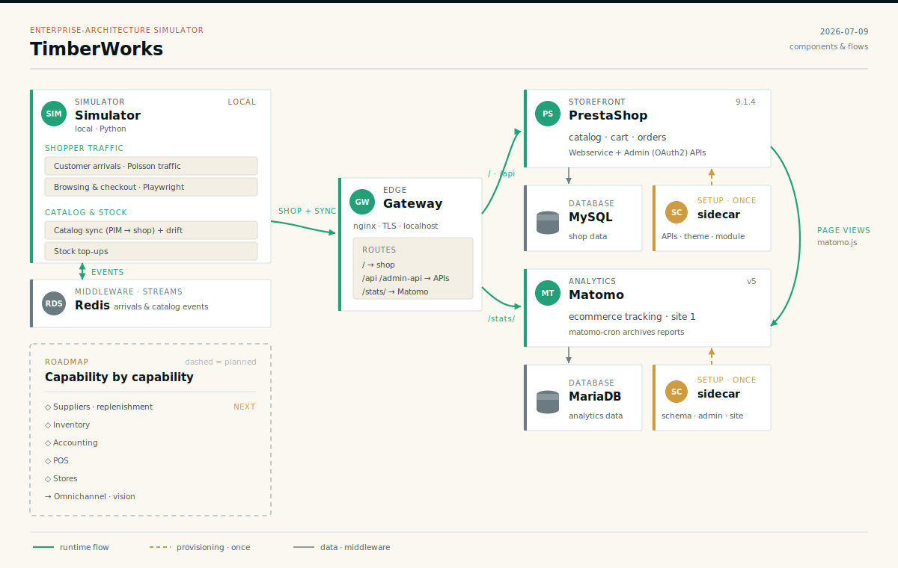

# TimberWorks — an enterprise-architecture simulator

<p align="center">
  
</p>

[Archipel Labs](https://archipellabs.com) is a public enterprise-architecture
lab: it **builds systems instead of describing them**. Instead of slideware and
diagrams, each project is a running system you can inspect.

This repository is the lab's flagship, **TimberWorks** — a simulated e-commerce
company that runs against a real stack, so architectural patterns (integration,
provisioning, load generation, observability) can be demonstrated on something
that actually works rather than sketched on a whiteboard.

## What's in the box

TimberWorks is a few cooperating pieces:

| Component | Path | What it is |
|---|---|---|
| **Simulator** | [`simulator/`](simulator/) | A Python producer/consumer app (Redis Streams + Playwright) that generates synthetic customer traffic and keeps the catalog and stock reconciled. No HTTP server — it is a runtime `App`. |
| **E-commerce workspace** | [`workspaces/default/`](workspaces/default/) | The Dockerized stack: PrestaShop + MySQL + Redis behind an nginx TLS gateway, with Matomo analytics and the activity database. |
| **Portal** | [`portal/`](portal/) | A FastAPI + React app serving journey analytics and a live cartography of the stack over the activity database. |
| **Setup sidecars** | [`sidecars/`](sidecars/) | Zero-dependency provisioning/install code — a PrestaShop CLI (ordered, idempotent steps) + a headless Matomo installer — run once as containers and shared across workspaces. |

The simulator and the storefront are deliberately decoupled: the simulator drives
the shop only through its public front-end (Playwright) and its APIs (Webservice +
Admin API), never through shared code or a shared database.

## Repository layout

```
simulator/                        Python load simulator, run locally (see simulator/README.md)
portal/                           analytics + cartography UI over the activity DB (FastAPI + React)
sidecars/                         run-once provisioning/install code, shared across workspaces
  prestashop/                     PHP CLI: turns a fresh PrestaShop install into the TimberWorks shop
  matomo/                         headless Matomo installer
workspaces/default/               the local demo stack
  docker-compose.yaml             entrypoint — creates the network, brings up the stacks + gateway
  docker-compose-ecommerce.yaml   storefront: PrestaShop, MySQL, Redis, provisioning sidecar
  docker-compose-tracking.yaml    Matomo web-analytics stack + its install sidecar
  docker-compose-simulator.yaml   simulator stack: activity DB (Postgres) + portal; the simulator app is deferred — run locally
  config/                         stack config: gateway (nginx + certs), demo secrets (env files)
  doc/                            TimberWorks brand: design.md, lore.md
  volumes/                        runtime data — DBs + PrestaShop web root (gitignored)
.github/workflows/                CI: lint / type-check / tests for the simulator and the portal
```

## Quickstart

### 1. Storefront + analytics (Docker)

Requires Docker with Compose v2. From `workspaces/default/`:

```sh
# Reading docker-compose.yaml creates the shared network (pinned subnet, matching
# PS_TRUSTED_PROXIES). On first boot the sidecars provision PrestaShop (API
# clients, purge demo data, theme, Matomo module…) and Matomo (schema, super user,
# Ecommerce site), then exit.
docker compose up -d
```

The storefront is served at `https://localhost` (self-signed cert), Matomo at
`https://localhost/stats/`, and the portal (journey analytics + cartography) at
`https://localhost:8443`.

### 2. Simulator (local Python — temporary)

For now the simulator runs from your host with Python, **not** in a container: a
host browser resolves `localhost` to the published gateway, so the shop's
canonical domain and the Matomo tracker work without extra DNS. Containerising it
needs a hostname that resolves the same on the host and inside containers — a small
DNS setup that's still TODO (see [`docker-compose-simulator.yaml`](workspaces/default/docker-compose-simulator.yaml)).

```sh
cd simulator
# one-time setup (uv sync, Playwright, generated clients) — see simulator/README.md
uv run python -m src.app
```

It reads `simulator/.env` (gitignored), defaulting to `https://localhost` +
`redis://localhost:6379`. Set the API credentials to match
`workspaces/default/config/prestashop/default.env` (`PRESTASHOP_WEBSERVICE_API_KEY`,
`PRESTASHOP_CLIENT_ID`, `PRESTASHOP_CLIENT_SECRET`), and turn on traffic with
`ARRIVALS_ENABLED=true`. Full knob list: [`simulator/README.md`](simulator/README.md).

## Configuration & secrets

The stack ships with **demo credentials that are committed on purpose** so the lab
runs out of the box. They are centralised and clearly labelled rather than
scattered inline:

- **[`workspaces/default/config/prestashop/default.env`](workspaces/default/config/prestashop/default.env)**
  — the single source of truth for the storefront stack's demo credentials
  (database, back-office admin, Admin API client, Webservice key). The compose
  services read it via `env_file`.
- **`simulator/.env`** (gitignored) — the local simulator's config; its API secrets
  must match `prestashop/default.env`. (The committed
  `config/simulator/default.env` is for the deferred Docker deployment.)

> ⚠️ **These are demo-only credentials for the local stack.** They are safe to
> commit *because they protect nothing real* (localhost, self-signed TLS, no
> public data). Never reuse them in any internet-facing deployment — generate
> fresh secrets there and keep them out of git.

## License

Licensed under the **Apache License 2.0** — see [LICENSE](LICENSE) and
[NOTICE](NOTICE). You are free to read, use, and build on this work; the only
condition is that the attribution notices are preserved.

Copyright © 2026 Loïc Veyssière / Archipel Labs.
