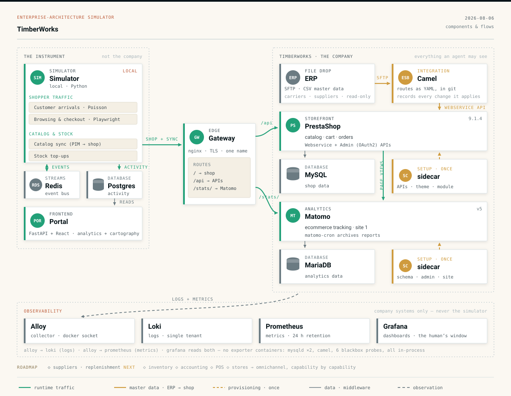

# TimberWorks — an enterprise-architecture simulator

<p align="center">
  
</p>

[Archipel Labs](https://archipellabs.com) is a public enterprise-architecture
lab: it **builds systems instead of describing them**. Instead of slideware and
diagrams, each project is a running system you can inspect.

This repository is the lab's flagship, **TimberWorks** — a simulated e-commerce
company that runs against a real stack, so architectural patterns (integration,
provisioning, load generation, observability) can be demonstrated on something
that actually works rather than sketched on a whiteboard.

## What's in the box

TimberWorks is a few cooperating pieces:

| Component | Path | What it is |
|---|---|---|
| **Simulator** | [`simulator/`](simulator/) | A Python producer/consumer app (Redis Streams + Playwright) that generates synthetic customer traffic and keeps the catalog and stock reconciled. No HTTP server — it is a runtime `App`. |
| **E-commerce workspace** | [`workspaces/default/`](workspaces/default/) | The Dockerized stack: PrestaShop + MySQL + Redis behind an nginx TLS gateway, with Matomo analytics and the activity database. |
| **Portal** | [`portal/`](portal/) | A FastAPI + React app serving journey analytics and a live cartography of the stack over the activity database. |
| **Sidecars** | [`sidecars/`](sidecars/) | Code that runs beside the stack rather than in it. Two are run-once provisioners (a PrestaShop CLI of ordered, idempotent steps; a headless Matomo installer); two are long-lived — Apache Camel carrying master data, and the ERP's own file drop over SFTP. |
| **Employees** | [`agents/`](agents/) | Six AI analysts (plus a model-free test double) that investigate the company through its own systems — the shop's API, the analytics, the logs, the ERP drop. One project, one image; `AGENT_NAME` decides who a container is. |

The simulator and the storefront are deliberately decoupled: the simulator drives
the shop only through its public front-end (Playwright) and its APIs (Webservice +
Admin API), never through shared code or a shared database.

**The employees are decoupled the same way, and for a stronger reason.** They
reach the company only as an employee would — through its APIs, its logs and its
file drop — and never through the simulator's activity database, which records
what each simulated customer *intended* and would be an answer key. What is being
measured is whether a company can be understood from the outside; a shortcut
through the instrument would measure nothing.

## Repository layout

```
simulator/                        Python load simulator, run locally (see simulator/README.md)
portal/                           analytics + cartography UI over the activity DB (FastAPI + React)
sidecars/                         run-once provisioning/install code, shared across workspaces
  prestashop/                     PHP CLI: turns a fresh PrestaShop install into the TimberWorks shop
  matomo/                         headless Matomo installer
  camel/                          the integration runtime: routes carrying master data from the ERP to the shop
  erpfile/                        the ERP's master data as CSV files, served over SFTP
agents/                           the AI employees — one project, one lock, one image
  core/                           the machinery they share: config, harnesses, the envelope, the bus mount
  roles/                          one directory per employee; `AGENT_NAME` picks which a process serves
  Dockerfile                      the single image (Python + the codex and opencode CLIs)
workspaces/default/               the local demo stack
  docker-compose.yaml             entrypoint — creates the network, brings up the stacks + gateway
  docker-compose-ecommerce.yaml   storefront: PrestaShop, MySQL, Redis, provisioning sidecar
  docker-compose-tracking.yaml    Matomo web-analytics stack + its install sidecar
  docker-compose-simulator.yaml   the simulator, its activity DB (Postgres) and the portal that visualises it
  docker-compose-integration.yaml the ESB: Apache Camel, carrying master data from the ERP to the shop
  docker-compose-erp.yaml         the ERP: master data as files, served over SFTP
  docker-compose-monitoring.yaml  logs, metrics and uptime (Alloy, Loki, Prometheus, Grafana) — company systems only
  docker-compose-agents.yaml      the AI employees — run separately, because they cost money
  config/                         stack config: gateway (nginx + certs), demo secrets (env files)
  doc/                            TimberWorks brand: design.md, lore.md
  volumes/                        runtime data — DBs + PrestaShop web root (gitignored)
.github/workflows/                CI: lint / type-check / tests for the simulator and the portal
```

## Quickstart

### 1. Hostnames (one-time)

Every service is served at the root of its own name, so those names have to
resolve on your machine. Add this to **`/etc/hosts`** (needs sudo):

```
# Archipel Labs — local stack
127.0.0.1    archipellabs.test
127.0.0.1    shop.archipellabs.test
127.0.0.1    tracking.archipellabs.test
127.0.0.1    portal.archipellabs.test
127.0.0.1    grafana.archipellabs.test
```

`.test` is reserved by RFC 6761 and can never collide with real DNS. The gateway
carries the same names as Docker network aliases, so **one URL works from your
browser and from inside a container** — which is what lets the simulator drive
Chromium against the storefront at all.

The TLS certificate is self-signed, so a browser will warn once; it is a proper
v3 certificate covering every name, so the warning is dismissable.

### 2. The whole stack (Docker)

Requires Docker with Compose v2. From `workspaces/default/`:

```sh
# Reading docker-compose.yaml creates the shared network (pinned subnet, matching
# PS_TRUSTED_PROXIES). On first boot the sidecars provision PrestaShop (API
# clients, purge demo data, theme, Matomo module…) and Matomo (schema, super user,
# Ecommerce site), then exit.
docker compose up -d
```

That brings up everything, simulator included:

| | |
|---|---|
| `https://shop.archipellabs.test` | the storefront (plus `/admin-dev`, `/api`) |
| `https://tracking.archipellabs.test` | Matomo |
| `https://portal.archipellabs.test` | the simulator's frontend — journey analytics + cartography |
| `https://grafana.archipellabs.test` | logs and metrics |

### 3. Running the simulator on your host instead

The simulator runs in Docker by default. To iterate on it, stop the container and
run it from source:

```sh
docker compose stop simulator

cd simulator
# one-time setup (uv sync, Playwright, generated clients) — see simulator/README.md
uv run python -m src.app
```

It reads `simulator/.env` (gitignored). The same hostnames work from the host, so
nothing else changes. Turn on traffic with `ARRIVALS_ENABLED=true`; full knob
list: [`simulator/README.md`](simulator/README.md).

## Configuration & secrets

The stack ships with **demo credentials that are committed on purpose** so the lab
runs out of the box. They are centralised and clearly labelled rather than
scattered inline:

- **[`workspaces/default/config/prestashop/default.env`](workspaces/default/config/prestashop/default.env)**
  — the single source of truth for the storefront stack's demo credentials
  (database, back-office admin, Admin API client, Webservice key). The compose
  services read it via `env_file`.
- **[`workspaces/default/config/simulator/default.env`](workspaces/default/config/simulator/default.env)**
  — what the simulator container reads. **`simulator/.env`** (gitignored) is the
  same config for a host-run simulator; its API secrets must match
  `prestashop/default.env`.
- **[`workspaces/default/config/agents/default.env`](workspaces/default/config/agents/default.env)**
  — what the employees read in-network: service names rather than the published
  ports a host process would use. **`agents/.env`** (gitignored) is the same
  config for running them from source.
- **[`workspaces/default/config/matomo/default.env`](workspaces/default/config/matomo/default.env)**
  and **[`config/monitoring/default.env`](workspaces/default/config/monitoring/default.env)**
  — the analytics and observability stacks.

**Three things are deliberately not committed anywhere**, and the agents' file
says so where it would otherwise carry them: the shop's Webservice key, the
Matomo token, and the model provider's key — the one that costs money. They go in
a `.env` beside the committed defaults, which the compose reads as an optional
second layer.

> ⚠️ **These are demo-only credentials for the local stack.** They are safe to
> commit *because they protect nothing real* (localhost, self-signed TLS, no
> public data). Never reuse them in any internet-facing deployment — generate
> fresh secrets there and keep them out of git.

## License

Licensed under the **Apache License 2.0** — see [LICENSE](LICENSE) and
[NOTICE](NOTICE). You are free to read, use, and build on this work; the only
condition is that the attribution notices are preserved.

Copyright © 2026 Loïc Veyssière / Archipel Labs.
